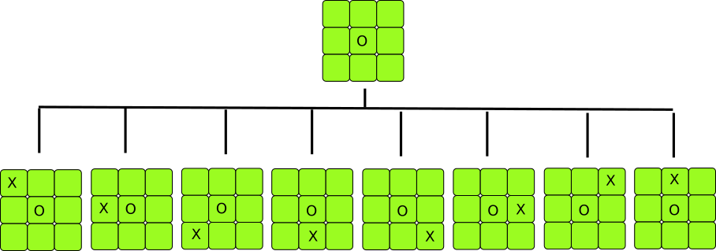
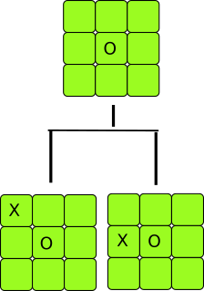

Minimax for TicTacToe
===

Board Design
--

The Game board is represented as a numpy 2D array of size 3x3. Each element in the board are located at the numbered position as illustrated below:

|  | | |
| :-------------: |:-------------:| :-----:|
| 0 | 1 | 2 |
| 3      | 4   |  5 |
| 6 | 7   |   8 |

For instance,  The position 4 indicates that the element is at index (1,1)

The player can place his marker, say 1, by entering any position in the range [0,8]. The AI then, plays its turn by placing its marker 2 on the board.

Optimization
--
- From a given empty board, there are around 133690 board states that can possibly occur before reaching the end of the game. These states significantly increase the decision time of the algorithm. Therefore, we must first aim to eliminate as many board states as possible. Considering that the board is symmetrical from both x and y axes, we can eliminate all board states which are mirrored images of existing ones. This is achieved by using the Rot90 and Flip methods of the numpy python library, which reduces the total number of states from 133690 to just 14443.

Before optimization
--

 

After optimization 
--

- There are multiple ways to win a game. Some of which take a lot of steps to reach the win state, while others take a few. The Minimax tree only tries to maximize the score and does not take number of steps for consideration. In order for minimax to take into account the fewer number of steps while maximizing the score,  tree depth has been deducted from the score. Hence, the deeper the tree, the lesser will be its score for that board.
